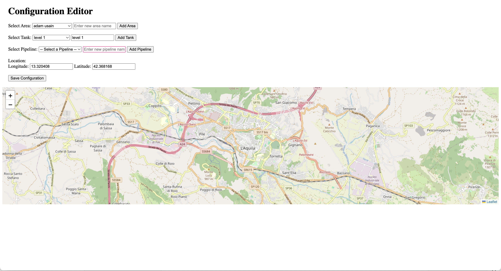

#  Water Quality Monistoring System

## [Introduction](#introduction)


This project is a water quality monitoring system that uses various sensors to monitor water quality and distribution. The system is built using Docker and includes services for Node-RED, MQTT Broker (Mosquitto), InfluxDB, and Grafana for data visualization.

## Set up Configuration file

Create a configuration file using the GUI or by editing the existing configuration file in the sensor folder. 

**- To Edit Existing Configuration**
- Go to [`Sensors/configuration.json`](Sensors/configuration.json) file.
- Add new Tank, pipeline, and Area following the existing format.

** - To use the GUI**
- Open the file [`ui_configuration_editor.html`](ui_configuration_editor.html) in your browser by copying the full file path and saving it to your browser.

- Add a new Area by typing in the Text box "Enter a new area name" and click "Add Area".
- Select the Area from the drop-down, and add a tank by typing in the name and selecting the location on the map. Click "Add Tank".
- Select Area, Tank, and add pipeline name and locations.
- Click "Save Configuration".


## Run the Project

1. **Setup the `.env` file**:
   - Make a copy of the `.env.example` file and rename it to `.env` in the same directory.
   - In this `.env` file, you can configure various environment variables needed for the project. For example, you can set up your **Telegram bot information** (like the bot token and chat ID), database configurations, API keys, etc.

2. **Run the project using Docker Compose**:
   - Open your terminal and navigate to the project directory.
   - Execute the following command to build and start the containers:
   ```bash
   docker-compose up --build
   ```

## System Achitectural Diagram


## 🛠️  Services

🔹 Node-RED
Node-RED is used for wiring together hardware devices, APIs, and online services.

🔹 MQTT Broker (Mosquitto)
Mosquitto is used as the MQTT broker for handling sensor data.

🔹 InfluxDB
InfluxDB is used for storing time-series data efficiently.

🔹 Grafana
Grafana is used for visualizing the data stored in InfluxDB.

🔹 Sensors
The sensors service is responsible for generating and publishing sensor data.


## Technologies Used
- **Docker:** Manages microservice containerization.
- **Eclipse Mosquitto:** Handles real-time MQTT messaging.
- **InfluxDB:** Stores time-series environmental data.
- **Grafana:** Displays real-time and historical data on dashboards.
- **Python:** Implements monitoring, analysis, and execution services.
- **Node Red :** Used for integrating data from different aspect of the system.

## Usage
- **View Real-Time Data:** Use the Grafana dashboard.
- **Configure Distribution Network:** Edit configuration files.
- **Check Logs:** View Docker container logs.

---

## Authors
- Mariama Celi S. de Oliveira
- Motunrayo Osatohanmen Ibiyo

## Professor
- Davide Di Ruscio (Software Engineering for Autonomous Systems)